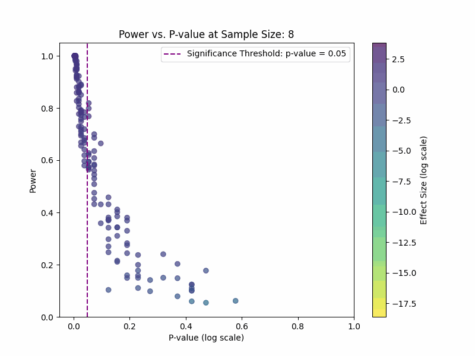
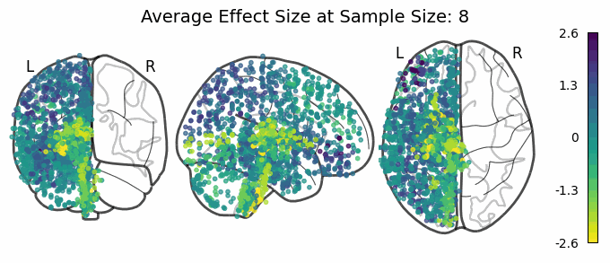

# Effect Size vs. Sample Size in NHST and its relevance for Genetics Research
---
In null hypothesis significance testing (NHST) it is possible to obtain significant results for negligibly small effect sizes. This repository contains the code and resources for analyzing and visualizing aimed to address the question of whether significant results of larger sample sizes are potentially overemphasized relative to smaller sample sizes and for what sample size the significance is hardly informative.

---
### I. Dataset: 
Dataset used: [Allen Brain Atlas](https://human.brain-map.org/). Data download scripts are included in the repo. 

---

## II. Project Structure and Setup Instructions

This guide will help you set up the project by installing Poetry, cloning the repository, and setting up the environment.

###  Project Structure 
- `gene-expression-analysis/`
  + `src/`
    - `configs/`
        Configuration Files for Paths .
    - `preprocessing/`
        Data transformation and migration scripts.
    - `utils/`
        Helper functions scripts
  + `data/`
    - `raw/`
        Downloaded Dataset using the `download_dataset.py` script.
    - `processed/`
        Transformed data and files after preprocessing.
    - `download_dataset.py`
  + `notebooks/`
    Notebooks for running experiments, analysis and visualization.
  + `results/`
    - `plots/`
        Plots exported from experiments.
    - `stats/`
        Files of the calculated statistics.
  - `README.MD`
  - `.gitignore`
  - `pyproject.toml`

---

### Project Setup Instructions
#### Prerequisites

Ensure you have the following installed:

- **Git** (for cloning the repository)
- **Python 3.8+** (make sure it is installed and accessible in your terminal)

### Steps to Set Up the Project

#### 1. Install Poetry (version 1.8.3)

Poetry is a tool for dependency management and packaging in Python. To install Poetry version 1.8.3, follow these steps:

##### For Unix-based Systems (Linux/macOS):

Run the following command to install Poetry version 1.8.3:

```bash
curl -sSL https://install.python-poetry.org | python3 - --version 1.8.3
```

You can confirm the installation by running the command:
```bash
poetry --version
```
and the result should be:
```bash
Poetry (version 1.8.3)
```

##### For Windows:

Use the documentation for [Poetry installation](https://python-poetry.org/docs/1.8/]) to guide you.


#### 2. Install Dependencies using Poetry 

Clone the repo: 
```bash
git clone https://github.com/KarimIbrahim11/Gene-Expression-Analysis.git
```
Then run the commands in order: 
```bash 
cd gene-expression-analysis
poetry install
poetry shell

```
To run `*.ipynb` notebooks simple open jupyter on browser by the following command:
```bash
python -m notebook
```
or if that didn't work as expected:  
```bash
poetry run python -m notebook
```

To run a `*.py` file: 
```bash
python <RELATIVE PATH OF THE PYTHON FILE>
```
or
```bash
poetry run python <RELATIVE PATH OF THE PYTHON FILE>
```
> Note: In most cases, it will be easier to run the notebooks in the `notebooks/` directory.

#### 3. Downloading Dataset, Transforming and Preprocessing

Downloading Dataset, Transformation and Preprocessing can be done all at once through the `notebooks/CS_00_Data_Transformation.ipynb` notebook. 

To download dataset only, simply run:
```bash
poetry run python data/download_dataset.py
```
You should be seeing:
```bash
Downloading from URL: https://human.brain-map.org/api/v2/well_known_file_download/178238387
normalized_microarray_donor9861.zip:   1%|▋                                                                                                 | 2.91M/426M [00:09<23:15, 303kB/s
...
```
dataset will be downloaded in `data/raw`. 

To tranform, clean and preprocess data run: 
```bash
poetry run python src/preprocessing/transform_data.py
poetry run python src/preprocessing/transform_data_json.py
poetry run python src/preprocessing/create_meta_donor_csv.py
```

Processed data will be in `data/processed`.

---

### III. Methodology Overview
Analysis in this repository takes place in multiple stages. They are all implemented in `.ipynb` notebooks:
1. Dataset Preprocessing 
    `notebooks/CS_00_Data_Transformation.ipynb`
2. Exploring Trends in Dataset
    `notebooks/CS_01_First Analysis.ipynb`
3. Normality and Clustering Tests and Visualizations
    `notebooks/CS_02_Statistical_Testing_Clustered.ipynb`
    `notebooks/CS_05_Effective_Regions_Unsupervised.ipynb`
    `notebooks/CS_07_Brain_Region_Effect_Size_VIsualization_Clustered.ipynb`
5. Calculating P-values, Power and Effect Size for Different Sample Sizes
    `notebooks/CS_03_Effect_VS_Sample_size_Brain_Regions.ipynb`
    `notebooks/CS_06_P-value_Power_VS_Sample_size.ipynb`
6. Brain MNI Visualizations of Effect Sizes
    `notebooks/CS_08_Brain_Region_Stats_VIsualization.ipynb`

---

### IV. Plots Excluded from Main Report
All visualizations can be reproduced from the aforementioned notebooks.

#### P-value, Power and Effect Sizes of Different Samples with Different Sample Sizes:



#### Effect Size of Different Brain Regions across Different Sample Sizes:


#### P-Values of Different Brain Regions across Different Sample Sizes:


#### Weighted Averaged of Brain Regions KDE: 


#### TSNE Visualization of Clusters:
 
